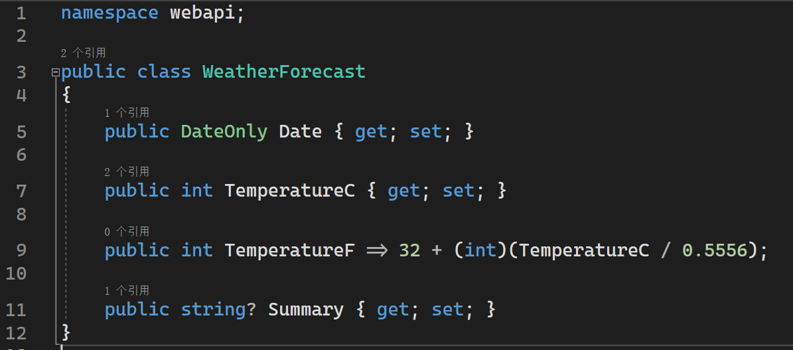
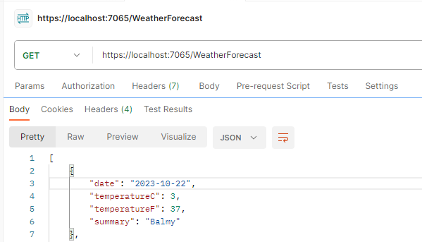
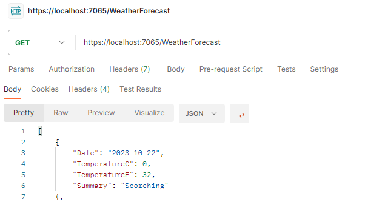

在调试 ASP.Net Core Web API 的代码时，发现前后两端明明格式一致，名称一致，但是前端无法渲染出数据的情况。最后经过才发现看到，ASP.Net Core Web API 返回的 Json 属性名为小驼峰（Camel Case）格式。

<!-- more -->

## 现象

如下图所示，在 `C#` 代码中，我使用的是大驼峰（Pascal Case）命名方式，即首字母是大写的。



而在 Postman 中，接收到的 Json 的属性名格式为小驼峰（Camel Case）格式，即首字母是小写的。而我在前端中的名称和后端一样，是采用的大驼峰（Pascal Case）命名方式，所以导致了前后两端明明格式一致，名称一致，但是前端无法渲染出数据的情况。



## 修改方法

`Program.cs` 的原代码为：

```C#
var builder = WebApplication.CreateBuilder(args);

// Add services to the container.
builder.Services.AddControllers();
... ...
```

改为：

```C#
var builder = WebApplication.CreateBuilder(args);

// Add services to the container.
builder.Services.AddControllers().AddJsonOptions(options =>
{
    options.JsonSerializerOptions.PropertyNamingPolicy = System.Text.Json.JsonNamingPolicy.CamelCase;
});
... ...
```

更改完成之后，在 Postman 中收到的就是自己定义的、未经处理的格式了。



## JsonSerializerOptions.PropertyNamingPolicy 属性的说明

| JsonSerializerOptions.PropertyNamingPolicy 属性的官方说明：  |
| ------------------------------------------------------------ |
| 获取或设置一个值，该值指定用于将对象的属性名称转换为其他格式（例如 camel 大小写）的策略；若为 `null`，则保持属性名称不变。 |

## 参考链接

### 官方文档

[设置 ASP.NET Core Web API 中响应数据的格式 | Microsoft Learn](https://learn.microsoft.com/zh-cn/aspnet/core/web-api/advanced/formatting?view=aspnetcore-7.0) 中的“配置基于 `System.Text.Json` 的格式化程序”这一章节。

[JsonSerializerOptions.PropertyNamingPolicy 属性 (System.Text.Json) | Microsoft Learn](https://learn.microsoft.com/zh-cn/dotnet/api/system.text.json.jsonserializeroptions.propertynamingpolicy?view=net-7.0#system-text-json-jsonserializeroptions-propertynamingpolicy)

### 网友的博客

[.Net Core3.0 WebApi 十三：自定义返回Json大小写格式 - 冰乐 - 博客园 (cnblogs.com)](https://www.cnblogs.com/taotaozhuanyong/p/13814891.html)
